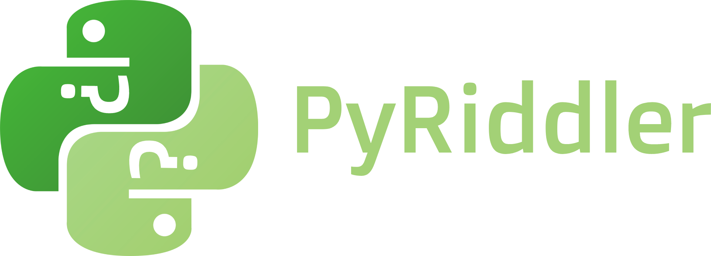

  
  <h3>The ultimate python riddle game!</h3>

## How to Play
PyRiddler is super easy to play with you and your friends! Guess the answer to the riddle on screen without running out of guesses and set yourself a high score! Each time you play again your score will increase, challenge your friends to see who can get the highest score! Local leaderboards allow you to track the best performance of anyone who plays on your machine.

### Setting Up
Make sure you have [Python 3+](https://www.python.org/downloads/) installed and have downloaded the files into a suitable place. Afterwards, ensure you have all dependancies by running `install.py`. Afterwards, simply run `menu.py` to launch PyRiddler. 

## Developers & Contributions
All contributions are welcome and encouraged from all skill levels!

### Riddle Contributions
Want to contribute riddles to the project? Awesome! Simply either open an issue with the suggested riddles of create a pull request adding them yourself. Default riddles can be found in `pyriddler/riddles.py` under the `default_riddles` variable.

Please ensure that all Riddles added are kept in English & have guessable one-word answers to maintain the projects accessability. 
